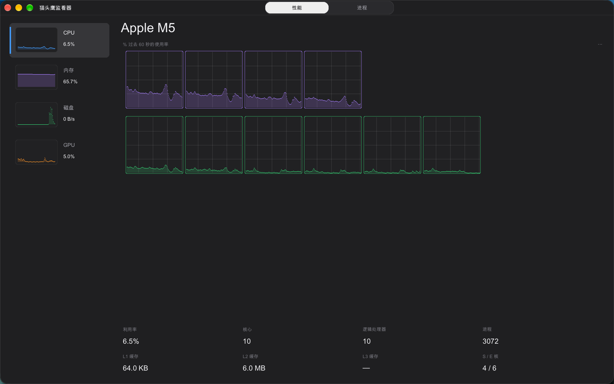
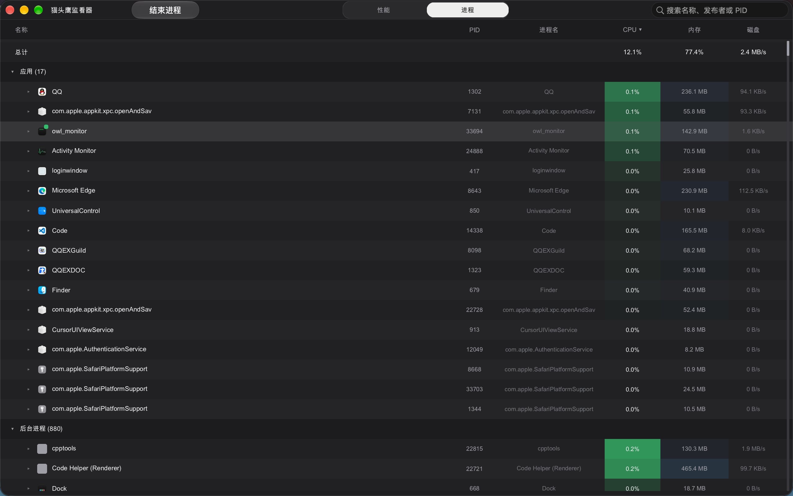

# OwlMonitor

A macOS task-manager UI built with **Vulkan** and **GLFW**, styled after the Windows 11 Task Manager. It uses a custom immediate-mode drawing system and a lightweight flex layout engine, and is fast and fluid. **The interface language follows the macOS system language** (Chinese on zh systems, English otherwise).

> Currently targeting macOS (Apple Silicon / Intel), running Vulkan through MoltenVK.

**Performance page** (Overview):



**Processes page**:



## Motivation

The built-in macOS **Activity Monitor** cannot distinguish between **foreground and background apps** (all processes are listed together), and per-process CPU / memory / disk usage is shown as **raw numbers only**, making it hard to see at a glance which app is consuming resources.

OwlMonitor draws inspiration from the Windows 11 Task Manager: it groups processes into **Apps / Background processes** and presents each process's resource usage with **colored icons + color bars / curves**, making resource consumption clear at a glance.

> This project is a transitional prototype and proof of concept for the product direction. The long-term plan is to migrate the app to Swift and build a native macOS application with a more idiomatic system integration and UI implementation.

## Features

### Top navigation
- **Horizontal top navbar** with **Performance** / **Processes** pages
- Selected item is a **white rounded rect** with a **smooth sliding animation**
- Borderless window: **transparent title bar + native traffic lights** (close / minimize / zoom)
- Drag the window by the **top bar**

### Performance page
- **CPU**: S / P / E logical-core grid (Apple's official naming) with a per-core usage sparkline
- **Memory**: usage curve + App / Wired / Compressed / Cached segments
- **GPU**: usage curve + architecture / memory info

### Processes page
- **Apps / Background processes** grouping (by window ownership, not just focus; minimized apps included)
- **Colored app icons** for both foreground and background processes
- Real-time **CPU / Memory / Disk** (disk shown as per-process I/O rate)
- **Click column headers to sort** (descending first, toggling asc/desc on re-click; defaults to CPU usage descending)
- **Search box** (native AppKit `NSSearchField`) to filter by process name / PID
- **Scrollbar + mouse-wheel clamping** (no blank space after collapsing groups)
- **End process**: selecting a row reveals a **native AppKit Liquid Glass `NSButton`** in the top bar; it shows a native confirmation sheet, first requests a graceful exit (SIGTERM), then offers a force end (SIGKILL) if it doesn't exit in time
- **Dark / light theme** (follows system) and **interface language follows system**

## Tech stack

- **C++20**
- **Vulkan 1.0** (via MoltenVK on macOS)
- **GLFW** (`GLFW_NO_API`)
- **stb_truetype** (font rasterization)
- Lightweight custom **flex layout engine** (`src/taskmgr/layout.hpp`)
- System sampling: `libproc` / `mach` / `IOKit` / `AppKit` / `CoreGraphics`
- Native AppKit controls for the search box (`NSSearchField`) and the end-process button (`NSBezelStyleGlass` `NSButton`)

## Build (macOS)

```sh
cmake --preset macos
cmake --build --preset macos
./target/owl_monitor
```

On first configure, CMake fetches and builds GLFW via `FetchContent`. Shaders (GLSL → SPIR-V) are extracted from source strings and compiled with `glslangValidator` at build time; no external shader files are needed at runtime.

## Directory structure

```
src/
├── main.cpp                    # entry point & main loop (GLFW)
├── platform/                   # platform abstraction (macOS Cocoa); platform_alert.mm native alert
├── render/                     # Vulkan renderer + font renderer + shader source
├── sys/                        # system sampling (process/CPU/memory/GPU/icon/frontmost)
└── taskmgr/                    # task-manager UI (layout/pages/charts/util)
```

## Known limitations

- Per-process **network / GPU** stats on macOS require private frameworks (`libtop` / `libIOReport`) or the `nettop` subprocess; currently **not implemented**. Disk / CPU / memory use public APIs.
- Some system / daemon processes (root, SIP-protected) may hide names and data, shown as **N/A**.
- Ending a process may fail for ones without permission (`EPERM`) or already gone (`ESRCH`); the UI handles this without side effects.

---

# OwlMonitor

一款基于 **Vulkan** 与 **GLFW** 构建的 macOS 任务管理器界面。采用自研即时模式绘图与轻量弹性布局引擎，整体仿 Windows 11 任务管理器风格，性能出色、交互流畅。**界面语言自动跟随 macOS 系统语言**（中文系统显示中文，英文系统显示英文）。

> 目前主要面向 macOS（Apple Silicon / Intel），通过 MoltenVK 运行 Vulkan。

**性能页**（概览）：


**进程页**：


## 项目动机

macOS 官方「活动监视器」**无法区分前后台应用**（所有进程混在一起），进程的 CPU / 内存 / 磁盘等资源占用**只有数字**，缺乏直观的图形化展示，很难一眼看出「哪个应用在吃资源」。

OwlMonitor 借鉴 Windows 11 任务管理器的体验，把进程按 **应用 / 后台进程** 分组，并用 **彩色图标 + 色块 / 曲线** 直观呈现每个进程的资源占用，让资源消耗一目了然。

> 该项目目前仅作为过渡项目，用于验证产品方向与交互方案。后续计划会迁移到 Swift 语言，重写为原生 macOS 应用，以获得更自然的系统集成和更优的界面表现。

## 特性

### 顶部导航
- **横向顶部导航栏**：性能 / 进程 两个页面
- 选中项为**白色圆角矩形**，切换页面带**平滑滑动动画**
- 无边框窗口：**透明标题栏 + 保留原生红绿灯**（关闭 / 最小化 / 缩放）
- 可在**顶部栏按住拖动窗口**

### 性能页
- **CPU**：S / P / E 逻辑核心网格（Apple 官方核心命名），每核带滚动占用曲线
- **内存**：使用曲线 + App / 联动 / 被压缩 / 已缓存 分段条
- **GPU**：使用率曲线 + 架构 / 显存信息

### 进程页
- **应用 / 后台进程** 分组（基于是否拥有窗口，非仅当前焦点，最小化应用也计入）
- **彩色应用图标**（前台/后台进程均可读取）
- 实时显示 **CPU / 内存 / 磁盘**（磁盘为 per-process I/O 速率）
- **点击表头列排序**（首次从大到小，再次点击切换升/降序；默认按 CPU 占用率降序）
- **搜索框**（原生 AppKit `NSSearchField`）：按进程名 / PID 过滤
- **滚动条 + 滚轮滚动限位**（折叠分组后不会滚出空白）
- **结束进程**：选中进程后顶部栏出现**原生 AppKit 液态玻璃按钮**；点击弹出系统原生确认框，先请求正常退出（SIGTERM），超时未退出可强制结束（SIGKILL）
- **深浅色主题**（跟随系统）、**界面语言跟随系统**

## 技术栈

- **C++20**
- **Vulkan 1.0**（macOS 通过 MoltenVK）
- **GLFW**（`GLFW_NO_API`）
- **stb_truetype**（字体栅格化）
- 自研轻量 **flex 布局引擎**（`src/taskmgr/layout.hpp`）
- 系统信息采集：`libproc` / `mach` / `IOKit` / `AppKit` / `CoreGraphics`
- 搜索框（`NSSearchField`）与结束进程按钮（`NSBezelStyleGlass` `NSButton`）使用原生 AppKit 控件

## 构建（macOS）

```sh
cmake --preset macos
cmake --build --preset macos
./target/owl_monitor
```

首次配置会通过 CMake `FetchContent` 下载并构建 GLFW。着色器（GLSL → SPIR-V）在构建期由源码字符串提取并用 `glslangValidator` 编译，运行时无需外部着色器文件。

## 目录结构

```
src/
├── main.cpp                    # 程序入口与主循环（GLFW 事件轮询）
├── platform/                   # 窗口/Surface/URL/时间等平台抽象；platform_alert.mm 原生弹窗（macOS Cocoa）
├── render/                     # Vulkan 渲染器 + 字体渲染器 + 着色器源码
├── sys/                        # 系统信息采样（进程/CPU/内存/GPU/图标/前台应用）
└── taskmgr/                    # 任务管理器 UI（布局/页码/图表/工具）
```

## 已知限制

- macOS 上**按进程**读取「网络 / GPU」需要私有框架（`libtop` / `libIOReport`）或 `nettop` 子进程，当前**未实现**；磁盘 / CPU / 内存走公开 API。
- 部分系统 / 守护进程（root、SIP 保护）可能读不到名称与数据，界面显示 **N/A**。
- 结束进程对无权限（`EPERM`）或已退出（`ESRCH`）的进程会失败，界面不产生副作用。
